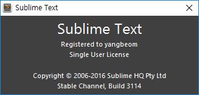
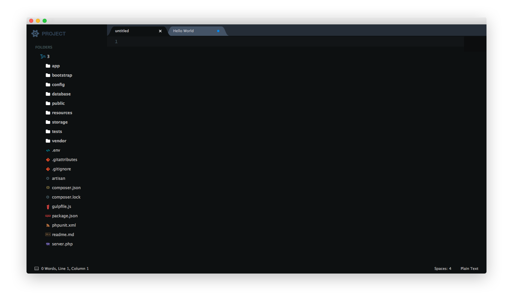

Sublime Text Setup
==================

컴퓨터를 재설치할때마다 자꾸 까먹어서 기록한다.

License 등록
------------

Package Control 설치
--------------------

`packagecontrol.io <https://packagecontrol.io/installation>`_ 에 들어가 코드를 복사한후

`control + \`` 를 눌러 붙여넣기후 엔터를 누르면 설치가 완료된다.

개인 설정
---------

`Preferences` - `Settings - Users` 에 들어가 설정을 한다.

개인적으로 사용하는것들은 다음과 같다.

"draw_white_space": "all"
~~~~~~~~~~~~~~~~~~~~~~~~~

이 옵션은 모든 white space를 다 보여주는 옵션이다.

"font_face": "D2Coding", "font_size": 15
~~~~~~~~~~~~~~~~~~~~~~~~~~~~~~~~~~~~~~~~

글꼴과 폰트크기를 조정하는 옵션이다. 한글도 종종 사용하기 때문에 D2Coding font를 사용하고 있다.

`D2 Coding <http://dev.naver.com/projects/d2coding/>`_ 은 누구나 사용할 수 있고 또 OFL 라이센스 하에서 누구나 재배포할 수 있다고 한다.

"tab_size": 4, "translate_tabs_to_spaces": true
~~~~~~~~~~~~~~~~~~~~~~~~~~~~~~~~~~~~~~~~~~~~~~~

다음은 tab을 눌렀을때 space 4개로 자동전환해주는 옵션이다.

"theme": "Seti.sublime-theme"
~~~~~~~~~~~~~~~~~~~~~~~~~~~~~

개인적으로 마음에 드는 theme이다.

Package Control: Install Package를 이용해서 `Seti_UI` 를 설치 하고 적어주어야한다.

적용한 화면은 다음과 같다.

"trim_trailing_white_space_on_save": true
~~~~~~~~~~~~~~~~~~~~~~~~~~~~~~~~~~~~~~~~~

줄끝에 있는 공백을 제거해주는 옵션이다.

"bold_folder_labels": true
~~~~~~~~~~~~~~~~~~~~~~~~~~
사이드바에서 폴더는 굵은 글씨로 표시하는 옵션이다.

